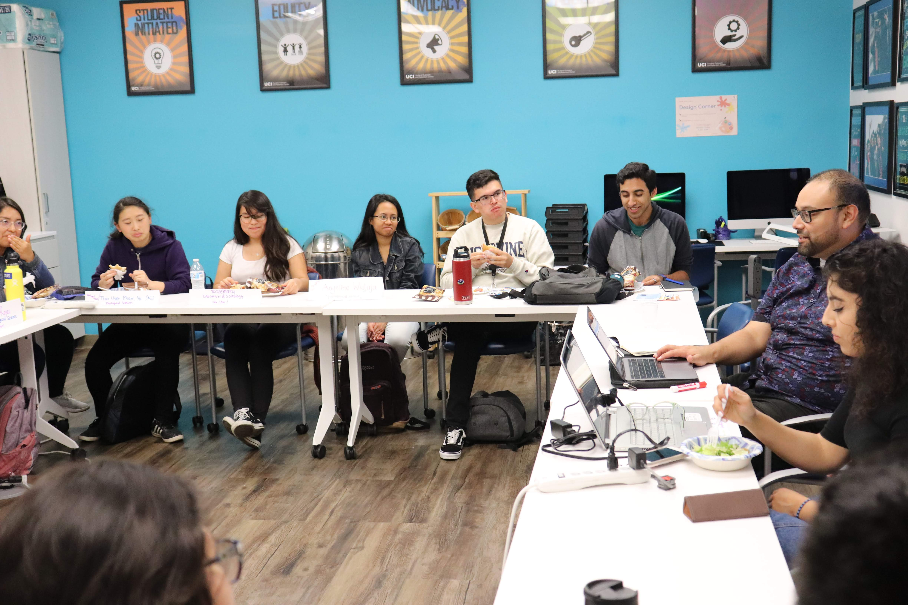

----

At California State, Chico, my journey has intertwined with the vibrant tapestry of affinity groups, each pulsing with the spirit of progress for Latinx professors and staff. Among these, the Chicano Latino Council stands out, a beacon of community and solidarity where ideas and aspirations converge. My role here is not just participation; it's a commitment to the collective advancement of our voices and presence on campus.In academic excellence, I've embraced the role of faculty advisor for the Sociology Department's Alpha Kappa Delta, the esteemed international honors society in sociology. Here, I'm not just an advisor; I'm a mentor, a guide, and a collaborator, working alongside our brightest minds. Together, we delve into the depths of sociological inquiry, celebrating academic achievements and fostering a culture of scholarly enthusiasm and curiosity.

----

During my eight years at UCI, I have dedicated myself to the mission of diversity and inclusion on campus. One area in which I have devoted the majority of my service is the recruitment of undergraduate students from underserved and underrepresented communities into graduate school programs.

----

<h3>**Leadership**</h3>

Since 2014, I have worked closely with UC Irvine's [Diverse Educational Community and Doctoral Experience (DECADE)](https://grad.uci.edu/about-us/diversity/decade/index.php) program to organize and lead workshops known as the *Know-How Sessions* to raise awareness amongst undergraduate students about graduate school opportunities. I also worked with DECADE's Student Executive Committee to implement, develop and expand relationships with departments and schools. This collaboration along with our community meetings helped to identify and address issues within each school and department at UCI, which were then documented and reported to the Dean of Graduate Studies as well as the Deans of each school at UCI.

----

<h3>**Mentorship**</h3>

In addition to my service with DECADE, I have spent the past four years serving as a Graduate Student Lead (GSL) for Graduate Division's Summer Research Program. The program’s mission is to prepare first-generation students from backgrounds traditionally underrepresented in graduate programs. Each summer I worked with a group of six to nine students to provide guidance and support as they conduct research with a professor and/or in a lab. As a graduate student mentor, my main objective was to help prepare them for the arduous process of applying to graduate school and fellowships. I was also candid with students about my own personal struggles and shared strategies for navigating academia as a first-generation, Latinx student. Over the past four years, nine of my students have accepted into doctoral programs at universities such as University of Michigan, Stanford, Georgia Tech and UCI, and three others have won fellowships from the National Science Foundation, Ford Foundation and American Political Science Association. In recognition of my commitment to mentoring at UCI, I received UCI's [Latino Excellence and Achievement Award](https://inclusion.uci.edu/action-plan/mentoring/latino-excellence-and-achievement-award/) in 2018.

----

<h3>**Outreach**</h3> 

In January 2020, I worked with UCI's [Student Outreach and Retention (SOAR) Center](https://soar.uci.edu/) to launch the [Graduate Access Preparation Program (GAPP)](https://soar.uci.edu/gapp/), a pilot program which aims to prepare twenty (20) first generation students with the graduate school application process. I helped to design and facilitate the curriculum for a series of workshops to motivate first-generation undergraduate students from underrepresented and underserved communities to pursue a graduate degree. The objectives of the workshops are to teach participants about graduate school, selection of graduate program, funding graduate education, and strategies for applying to graduate programs. At the end of the course, the students receive a voucher for a free GRE preparation course.

---

Copyright &copy; `r format(Sys.Date(), '%Y')` Martín Jacinto. All rights reserved.

