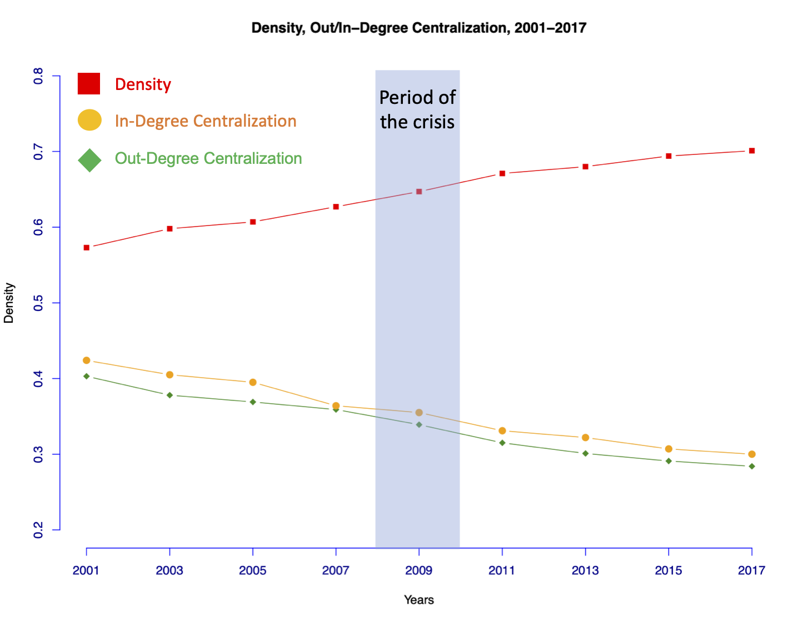

----

Sociologists have long been interested in the effects of economic globalization on the lives of local communities across the world. Over the past 30 years, growing international trade has resulted in greater worldwide integration of national, regional, and domestic economies into the world economy. As a result, multilateral trade has become reliant on large and complex interconnected networks of production and trade in which the contemporary world economy now rests upon. Yet, despite unprecedented economic globalization in recent years, greater interconnectedness has reshaped not eradicated economic inequalities between and within nation-states.

Economic markets are now more global than ever before. People, firms, organizations, and governments invest in markets all over the world. As a consequence, economic downturns in one country transmit across the globe at an unprecedented speed and magnitude. Case in point, the 2008 collapse of the US housing market quickly spread across the world economy. The economic globalization of the past 30 years laid the groundwork for the worldwide market turmoil that came from the 2008-2009 Global Economic Crisis. However, the literature remains unclear as to the long-lasting effects of the 2008-2009 global economic crisis on economic globalization. 

My research applies a social network perspective to triangulate a link between economic globalization, economic crises, and economic development at both the macro- and micro-levels of the world economy. Following a social network approach, I conceptualize the world economy as comprised of a large and complex network of commerce; in this case, international trade. I seek to answer the following:

  * *How did the 2008-2009 Global Economic Crisis affect inequalities between and within countries?* 
  * *Did the 2008 impede further economic globalization in the world economy? Or did the crisis gave way to greater globaliztion?*
  * *In what ways did these global networks respond and adapt to a large-scale global economic crisis?*

Below are snapshots of my research projects that are dedicated to the study of crisis, globalization, and inequality.

----

## **Density and Centralization in the International Trade Network after the 2008-2009 GEC**

*Did the 2008-2009 global economic crisis make the world economy less interconnected?* The collapse of the US subprime mortgage market triggered a global economic recession that brought the largest economies in the world to near collapse. The crisis' widespread impact on the world economy underscored the role of economic globalization--in the form of globalized trade, production, and finance--in facilitating the speed and transmission of the crisis' widespread impact. While there is considerable agreement that the crisis had an effect on economic relations between markets, nation-states, firms, and regions, there is less agreement on how, much less whether, the crisis affected this long-standing trend of greater global interconnectedness. Two central research questions guide this investigation. First, does the international network continually exhibit a significant decrease, increase, or no change in global interconnectedness? Second, does the world economy, as a result, exhibit a more or less centralized world economy following the period of the 2008-2009 crisis? The theoretical literature presents conflicting findings of the 2008-2009 global economic crisis' impact on economic globalization and the world economy in general. To adjudicate between these claims I conduct a network analysis of international trade networks over nine points in time between 2001 and 2017. Results from this study demonstrate that there are significant increases in the distribution of ties that is showing that the international trade network has become more decentralized as a consequence. This study elucidates the role of trade networks play in maintaining an open international economy despite the devastating impact of the 2008-2009 crisis on the world economy.

----

## **The Core/Periphery Structure of the World Economy in the Wake of the 2008-2009 GEC**

*Did the 2008-2009 Global Economic Crisis change the hierarchy of the world economic system?*

Findings from my research shows that over the past two decades the world economy has experienced two long-term development trends: the growing influence of emerging economies on the structure of the world economy and declining influence from historically dominant economies from Global North countries such as the US, UK and Japan. A key reason has been the increasing trade relations within and between regions commonly associated with the Global South, including Latin America, Sub-Saharan Africa, South and West Asia, North Africa and the Middle East, which are mediated by large emerging economies such as China, India, Brazil and South Africa. During and immediately after the crisis, these large emerging economies facilitated and expanded transnational links for smaller developing economies across the Global South, and thus provide further empirical evidence that the crisis facilitated increased Global South-to-South Cooperation across the international trade network. As a result, the hierarchy of the world economy has become less vertical and more horizontal. However, historically marginalized countries in Sub-Saharan Africa and smaller island nations remain at the periphery of the international trade network. 

 

**The Core/Periphery Structure in 2001**

 
 
**The Core/Periphery Structure in 2011**

 