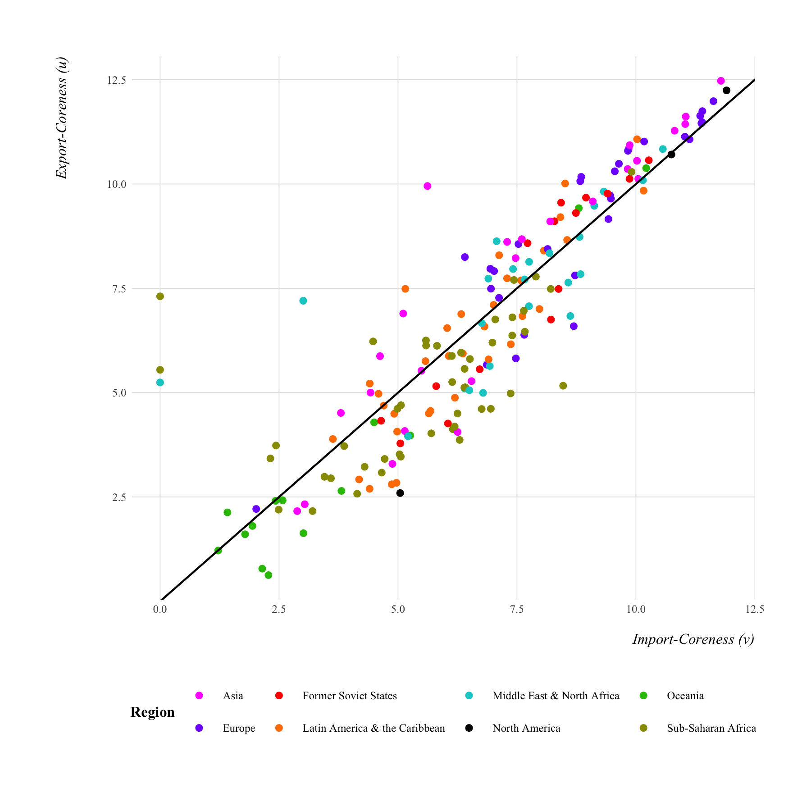

----

<h3>**Global Economic Crisis, Globalization, and Development**</h3>
Sociologists have consistently explored the impact of economic globalization on local communities worldwide. Over the past four decades, expanding international trade has increased national, regional, and local economies integration into the global market. This evolution has given rise to intricate, interconnected production and trade networks, forming the backbone of the modern world economy. However, despite the recent surge in economic globalization, this heightened interconnectedness has also transformed economic inequalities between and within nations.

Economic markets have reached unprecedented global interconnectivity. Investments by people, firms, organizations, and governments now span across the globe, making economies more interdependent than ever. This interconnectedness means economic downturns in one nation can rapidly and significantly impact the global market. A prime example is the 2008 U.S. housing market collapse, swiftly rippling the world economy. The last four decades of economic globalization set the stage for the tumultuous worldwide impact of the 2008-2009 Global Economic Crisis. While existing literature provides insights, it needs more clarity on the long-term effects of the 2008-2009 crisis on global economic trends. My research contributes significantly to this area, offering a nuanced understanding of the crisis's impact on the trajectory of economic globalization. By analyzing patterns and shifts in global economic interdependencies post-2008, my work enriches sociological perspectives on global market dynamics, enhancing our understanding of contemporary social, economic, and political phenomena.

My research adopts a social network perspective to investigate the relationship between global trade, economic crises, and economic productivity across both macro and meso levels of the world economy. Specifically, I aim to answer the following questions:

  * *How did the hierarchy of the global trade network adapt to the impact of the 2008–09 global economic crisis?* 
  * *How did a country's position in the hierarchy influence their upward mobility during the crisis?*
  * *To what extent does a country's position within the world-system hierarchy influence its economic productivity, especially after a global economic downturn?* 

Below are snapshots of my research projects that are dedicated to the study of crisis, globalization, and structural inequality at the macro-level of the world economy. Using international trade data from the International Monetary Fund's [*Direction of Trade Statistics*](https://data.imf.org/?sk=9D6028D4-F14A-464C-A2F2-59B2CD424B85), I constructed network trade data of 191 countries across a 17-year time-period (2001-2018). Data analysis was completed using the `sna` [package](https://cran.r-project.org/web/packages/sna/sna.pdf) in [R Studio](https://www.rstudio.com/).

----

<h2>Density and Centralization in the Global Trade Network</h2>

The size and density of a social network are important indicators for measuring network connectivity. **Network size** refers to the number of nodes in a network and is critical for the structure of social relations and formation of hierarchies within the network. The **density** of a graph measures of how many ties between actors exist compared to how many ties between actors are possible.

<h4>**In- and Out-Degree Centralization**</h4>

**Degree centralization**– The distribution of influence and prestige in the network.
When network ties are directed, we factor both the volume of ties sent (out-degree) and ties received (in-degree).

**Out-degree centralization** typically indicates influence.

**In-degree centralization** indicates prestige or popularity.
  

<h4 style="text-align:center; color:#254117;"><u>Density and Degee Centralization in the Global Trade Network</u></h4>
 

 

----

<h2>The Core-Periphery Structure of the Global Trade Network</h2>

Globalization in the late 20th century has given rise to a global international division of labor that has segmented into a core-periphery structure. In social network analysis, the core-periphery structure is an elemental network pattern that refers to the presence of two qualitatively distinct components: a dense "core" of tightly connected actors and a sparse “periphery” of actors that are tightly connected to the core and loosely among each other. In the case of global trade, the core are highly interconnected with most other nation-states across the entire global economic system whereas peripheral nation-states, on the other hand, are the least interconnected and mainly depend on their economic relations with the core. 

 
<h3>The Core/Periphery Structure in 2007</h3>

 

 
<h3>The Core-Periphery Structure in 2011</h3>

 

 
<h3>The top 20 nation-states in the core-periphery structure</h3>

---

Copyright &copy; `r format(Sys.Date(), '%Y')` Martín Jacinto. All rights reserved.

