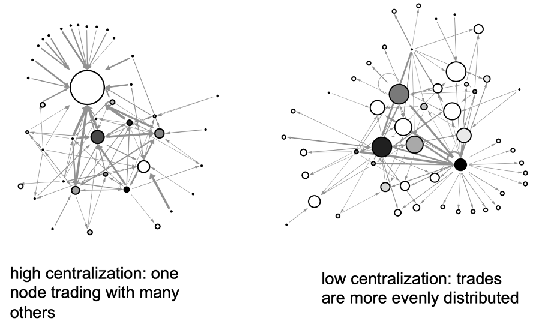

----

<h3>**Global Economic Crisis, Globalization, and Inequality**</h3>
Sociologists have long been interested in the effects of economic globalization on the lives of local communities across the world. Over the past 30 years, growing international trade has resulted in greater worldwide integration of national, regional, and domestic economies into the world economy. As a result, multilateral trade has become reliant on large and complex interconnected networks of production and trade in which the contemporary world economy now rests upon. Yet, despite unprecedented economic globalization in recent years, greater interconnectedness has reshaped economic inequalities between and within nation-states.

Economic markets are now more global than ever before. People, firms, organizations, and governments invest in markets all over the world. As a consequence, economic downturns in one country transmit across the globe at an unprecedented speed and magnitude. Case in point, the 2008 collapse of the US housing market quickly spread across the world economy. The economic globalization of the past 30 years laid the groundwork for the worldwide market turmoil that came from the 2008-2009 Global Economic Crisis. However, the literature remains unclear as to the long-lasting effects of the 2008-2009 global economic crisis on economic globalization. 

My research applies a social network perspective to triangulate a link between economic global trade, economic crises, and economic productivity at both the macro- and micro-levels of the world economy. I seek to answer the following:

  * *How did the recession following the 2008-09 global financial crisis affect inequalities between and within nation-states?* 
  * *How did the 2008-09 crisis affect economic globalization across the world economy?*
  * *How did a nation-state's position in the global trade network mediate their economic productivity following the 2008-09 crisis?* 

Below are snapshots of my research projects that are dedicated to the study of crisis, globalization, and structural inequality at the macro-level of the world economy.

----

<h2>Density and Centralization in the Global Trade Network</h2>

The size and density of a social network are important indicators for measuring network connectivity. **Network size** refers to the number of nodes in a network and is critical for the structure of social relations and formation of hierarchies within the network. The **density** of a graph measures of how many ties between actors exist compared to how many ties between actors are possible.

<h4>**In- and Out-Degree Centralization**</h4>

**Degree centralization**– The distribution of influence and prestige in the network.
When network ties are directed, we factor both the volume of ties sent (out-degree) and ties received (in-degree).

**Out-degree centralization** typically indicates influence.

**In-degree centralization** indicates prestige or popularity.
  

<h4 style="text-align:center; color:#254117;"><u>Examples of networks with high and low degree centralization</u></h4>

<h4 style="text-align:center; color:#254117;"><u>Density and Degee Centralization in the Global Trade Network</u></h4>
 

 

----

<h2>The Core-Periphery Structure of the Global Trade Network</h2>

Globalization in the late 20th century has given rise to a global international division of labor that was segmented into a core-periphery structure. In social network analysis, the core-periphery structure is an elemental network pattern that refers to the presence of two qualitatively distinct components: a dense "core" of tightly connected actors and a sparse “periphery” of actors that are tightly connected to the core and loosely among each other. In the case of global trade, the core are highly interconnected with most other nation-states across the entire global economic system whereas peripheral nation-states, on the other hand, are the least interconnected and mainly depend on their trade relationships with the core. 

 
<h3>The Core/Periphery Structure in 2007</h3>

 

 
<h3>The Core-Periphery Structure in 2011</h3>

 

 
<h3>The top 20 nation-states in the core-periphery structure</h3>

Copyright &copy; `r format(Sys.Date(), '%Y')` Martín Jacinto. All rights reserved.

